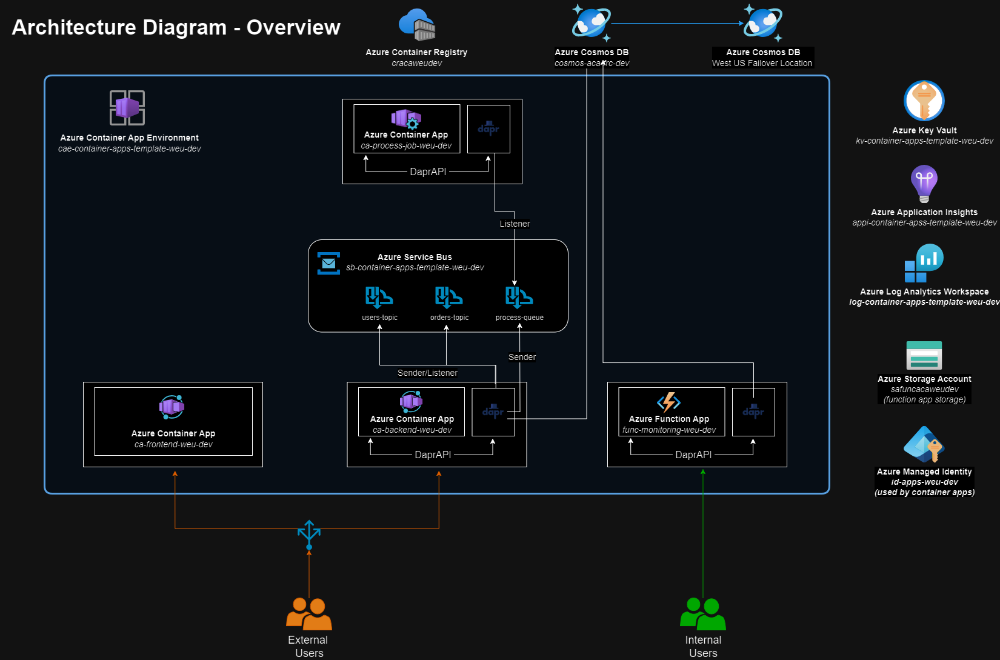

# Terraform Azure Container Apps Project

This project contains Terraform code to provision and manage an **Azure Container Apps** solution. The architecture includes backend and frontend components, DAPR integrations, Cosmos DB, Service Bus, and monitoring with Application Insights.



## 📖 Scenario

### What could be the Use Case for such an architecture?

This architecture could serve as the foundation for an e-commerce solution with a traditional front-end and a modular, event-driven backend.

#### E-commerce Workflow
The frontend would provide customers with a user-friendly interface for browsing products, managing their accounts, and placing orders.

The backend would follow a modular monolith architecture, hosting multiple modules (e.g., "Users," "Orders") that handle specific domains. These modules would communicate asynchronously via a message bus (Service Bus Topics) to ensure scalability and decoupling.

#### Order Finalization Process
When a customer finalizes an order, a container app job would handle the processing by interacting with external services:
- Billing: To process payment transactions.
- Loyalty: To update customer rewards or loyalty points.
- Stock Management: To place orders for inventory restocking.

#### Data Insights for Business Analysts
Business analysts could connect their preferred tools (e.g., Power BI, Excel, or custom dashboards) to lightweight HTTP endpoints provided by a Function App.

The Function App would query order and stock data stored in Cosmos DB, enabling real-time insights into inventory levels, sales performance, and trends.

## 📁 Project Structure

The project structure is as follows

```plaintext
├── .devcontainer/                        # Development container configuration
│   ├── devcontainer.json     
│   └── Dockerfile            
├── .github/                              # (Optional) CI/CD pipelines or workflows
├── terraform/                            # Terraform root directory
│   ├── .terraform/                       # Terraform state and provider configurations
│   ├── modules/                          # Custom Terraform modules
│   │   ├── container-app/    
│   │   ├── container-app-function/      
│   │   ├── container-app-job-bus-trigger/
│   │   └── ...
│   ├── app-backend.tf                    # Backend Container App
│   ├── app-frontend.tf                   # Frontend Container App
│   ├── application-insights.tf           # Application monitoring with Azure Insights
│   ├── container-app-dapr-components.tf  # DAPR components
│   ├── container-app-environment.tf      # Azure Container Apps Environment
│   ├── container-registry.tf             # Azure Container Registry 
│   ├── cosmos-db.tf                      # Azure Cosmos DB 
│   ├── key-vault.tf                      # Azure Key Vault
│   ├── locals.tf                         # Local values shared inside code
│   ├── log-analytics-workspace.tf        # Log Analytics Workspace configuration
│   ├── managed-identity.tf               # Azure Managed Identity User Assigned
│   ├── monitoring-functions.tf           # Azure Function for monitoring purpose
│   ├── process-job.tf                    # Azure Container App Job for long processing task
│   ├── providers.tf                      # Terraform provider configurations
│   ├── resource-group.tf                 # Azure Resource Group
│   ├── service-bus.tf                    # Azure Service Bus
│   └── variables.tf                      # Input variables for the Terraform project
├── .gitignore                
└── README.md                             # Documentation (you are here !)
```

## 🚀 Purpose

This project uses Terraform to manage the following cloud resources on Azure

- Azure Container Registry - Manage container images for deployment.
- Azure Container Apps - Deploy scalable containerized applications :
    * A backend with modular monolith architecture based on event-driven design
    * A frontend for clients
    * A function app with Http Trigger used for monitoring by employees
    * A job for long process tasks
- Azure DAPR Components - Integration with DAPR for distributed application development.
- Azure Cosmos DB - Manage a NoSQL database for scalable storage.
- Azure Service Bus - Implement messaging and event-driven communication.
- Azure Key Vault - Storing secrets 
- Log Analytics - Collect and analyze logs from Azure resources.
- Application Insights - Enable logging, monitoring, and analytics for applications.

## 🛠️ What's inside ?

This section highlights the specific features of the Terraform setup.

### Container Apps
The Container Apps use a basic serverless setup : 
- No additional workload profile.
- Default vNet integration.

#### Modules
Two modules are included: **Users** and **Orders**.

Both modules leverage DAPR for infrastructure abstraction:
- Cosmos DB Component: Used for database access.
- Azure Service Bus Component: Configured with separate topics for each module (one for sending and one for receiving subscriptions).

Each module has its own Cosmos DB Database within a shared Cosmos DB Account.

#### Image Management

Currently,  the modules use a default image (no code is provided). In your project, you should provide the correct image and tag through a CI/CD pipeline. 

Access to **Azure Container Registry** is handled via a **User Managed Identity** (shared across all Azure Container Apps).

### Cosmos DB
Cosmos DB account is geo-replicated in a secondary region for failover purposes. 

Each module uses its own database within the shared account. Access to a database is made through the shared **User Managed Identity** for security and consistency

### Service Bus

Two Service Bus Topics are provisioned (one for each module).

Each topic includes:
- One Subscription for receiving messages (in the other module).
- Sender/Listener Rules for publishing messages.

Connection strings are securely passed to DAPR components for seamless integration.

### Function App

Function App is deployed as part of the Azure Container App Environment It benefits from **vNet Integration** for secure access to internal resources. It leverages **KEDA** for scaling, including **scaling to zero** when idle.

#### Implementation Note
Since the Azure Function App in this setup is relatively new, no dedicated Terraform provider is available yet. Instead, the deployment uses the **azapi_resource** to configure the Function App. 

After deployment, you will find an additional Azure Resource Group named something like: *"{Your ACE Name}_ FunctionApps _{GUID}"*. Within this group, there will be an Azure Container App resource with the same name as the Function App.
 
## 🧩 Reusable Modules
The **modules** folder includes reusable modules for:

- Container Apps (container-app)
- Functions deploy inside a Container Apps Environment (container-app-function)
- Container App Job with Service Bus Triggers (container-app-job-bus-trigger)

Modules promote clean, reusable, and modular Terraform code.

## ⚙️ Prerequisites

Before starting, ensure you have the following tools installed:


A valid Azure Subscription with necessary permissions.

- **[Visual Studio Code](https://code.visualstudio.com/)** with the **Dev Containers** extension (`ms-vscode-remote.remote-containers`)
- **[Docker Desktop](https://www.docker.com/products/docker-desktop/)** to run containers locally

or 

- **[Visual Studio Code](https://code.visualstudio.com/)** without specific extension
- **[Terraform](https://developer.hashicorp.com/terraform/install)**
- **[Azure CLI](https://learn.microsoft.com/en-us/cli/azure/install-azure-cli-windows?tabs=azure-cli#install-or-update)**

## 🚧 Getting Started

### 1. Launch Development Environment with Dev Containers

Open the project in VS Code.

Ensure the Dev Containers extension is installed.

Open the command palette (Ctrl+Shift+P or Cmd+Shift+P) and select:

```bash
Dev Containers: Reopen in Container
```

This will rebuild and launch the development environment inside a Docker container.

### 2. Initialize Terraform

To set up the Terraform backend and download providers and modules, use the following command:

```bash
terraform init
```

You should provide extra values for your terraform backend. For instance : 

```bash
terraform init \
  -backend-config="resource_group_name=<RG name where the terraform storage is>" \
  -backend-config="storage_account_name=<terraform storage account name>" \
  -backend-config="container_name=<terraform container name>" \
  -backend-config="key=<terraform tfstate file name>.tfstate"
```

### 3. Apply Terraform Code

After initializing, apply the Terraform configuration to provision the infrastructure:

```bash
terraform apply
```
You should provide variable values to apply. For instance you could have a tfvars file :

```
subscription_id = ""
region          = "westeurope"
region_code     = "weu"
environment     = "dev"
product_code    = "aca"
product_name    = "container-apps-template"
owner           = ""
```

and then apply with var-file :

```bash
terraform apply -var-file=local.tfvars
```

## 🔗 Useful Resources

- [Azure Container Apps](https://learn.microsoft.com/en-us/azure/container-apps/overview)
- [Terraform Documentation](https://developer.hashicorp.com/terraform/docs)
- [Azure Terraform provider Documentation](https://registry.terraform.io/providers/hashicorp/azurerm/latest/docs)
- [DAPR Documentation](https://docs.dapr.io/)
- [Dev Containers based on Dockerfile Documentation](https://code.visualstudio.com/docs/devcontainers/create-dev-container#_dockerfile)

## Contributing

Pull requests are welcome. For major changes, please open an issue first
to discuss what you would like to change.

## License

[MIT](https://choosealicense.com/licenses/mit/)
